# AutoRollCall (`troTHU`) 重構分析報告

> 基於對全部 74 個原始碼檔案的逐一深入閱讀，彙整而成的完整分析。

---

## 專案概覽

| 指標 | 數值 |
|---|---|
| 原始碼檔案 | 74 個 `.py` (troTHU/) |
| 測試檔案 | 58 個 (tests/) |
| 總原始碼大小 | ~880 KB |
| 最大檔案 | `radar_runtime.py` (55.4 KB, 1206 行) |
| 外部依賴 | 3 個 (aiohttp, PyYAML, PyNaCl) |
| 選用依賴 | 4 群 (keyring, PyInstaller, opencv+pillow, playwright) |

### 架構總覽

```mermaid
graph TD
    subgraph "入口"
        TRON["tron.py<br/>(entrypoint)"]
        CLI_MAIN["cli_main.py<br/>(dispatch)"]
        CLI_PARSER["cli_parser.py<br/>(argparse)"]
    end

    subgraph "中樞 — God Module"
        CTX["runtime_context.py<br/>1118 行 · 250+ lazy exports<br/>30+ mutable globals"]
    end

    subgraph "核心點名引擎"
        MON["monitor_runtime.py<br/>637 行"]
        RR["rollcall_runtime.py<br/>275 行"]
        NUM_RT["number_runtime.py"]
        RAD_RT["radar_runtime.py<br/>1206 行 ⚠️"]
        QR_RT["qr_runtime.py"]
        QR_T["qr_teacher_runtime.py"]
    end

    subgraph "純資料 / 演算法 (✅ 乾淨)"
        NUM_RC["number_rollcall.py"]
        RAD_RC["radar_rollcall.py"]
        QR_RC["qr_rollcall.py"]
        RC_MOD["rollcall_models.py"]
        RC_ENG["rollcall_engine.py"]
        RC_PRG["rollcall_progress.py"]
        RAD_SOL["radar_solver.py"]
        GRAD_SOL["global_radar_solver.py"]
    end

    subgraph "設定 / 帳號"
        CFG_RT["config_runtime.py<br/>596 行"]
        SIMPLE["simple_config.py"]
        AUTH["auth_runtime.py<br/>603 行"]
        ACCT["account_store.py"]
        ACCT_RT["account_runtime_store.py"]
        PROV["providers.py"]
    end

    subgraph "Bot / Adapter"
        BOT_RT["bot_runtime.py<br/>28 KB"]
        BOT_H["bot_handlers.py"]
        DISC["discord_adapter.py"]
        LINE["line_adapter.py"]
        TELE["telegram_adapter.py"]
        ADP_SRV["adapter_server.py"]
        ADP_BR["adapter_bridge.py"]
    end

    subgraph "Companion UI"
        APP_SH["app_shell.py<br/>24 KB"]
        APP_BP["app_blueprint.py"]
        APP_DASH["app_shell_dashboard.py"]
        APP_POL["app_shell_polish.py"]
        SCAN["local_scanner.py"]
        WV["webview_sync.py"]
    end

    TRON --> CLI_MAIN
    CLI_MAIN --> CTX
    CTX -.->|lazy __getattr__| MON & RR & NUM_RT & RAD_RT & QR_RT & CFG_RT & AUTH & BOT_RT & APP_SH
    MON --> RR --> NUM_RT & RAD_RT & QR_RT
    QR_RT --> QR_T
    RAD_RT --> RAD_SOL & GRAD_SOL

    style CTX fill:#ff6b6b,color:#fff
    style RAD_RT fill:#ffa94d,color:#fff
    style BOT_RT fill:#ffa94d,color:#fff
    style APP_SH fill:#ffa94d,color:#fff
```



---

## 🔴 十大結構性問題

### 問題 1：God Module — `runtime_context.py`

> [!CAUTION]
> 這是整個專案最核心的結構性問題，所有其他問題都由此衍生。

| 面向 | 現況 |
|---|---|
| 行數 | 1118 行 |
| 早期匯入 (try/except 雙路徑) | ~465 行純複製 |
| `_LEGACY_EXPORTS` 條目 | 257 個 |
| 可變全域狀態 | 30+ 個模組級變數 |
| `DEFAULT_CONFIG` | ~170 行巢狀 dict |

**運作機制：**
```python
# 每個模組都這樣寫：
import troTHU.runtime_context as ctx

# 然後透過 ctx 存取一切：
ctx.login(session)          # 實際在 auth_runtime.py
ctx.bootstrap_config()      # 實際在 config_runtime.py
ctx.monitor_loop(...)       # 實際在 monitor_runtime.py
ctx.CONFIG['account']       # 可變全域 dict
ctx.cnt += 1                # 裸整數計數器
```

**加劇問題的 `__getattr__` 代理：** `monitor_runtime.py`、`config_runtime.py`、`number_runtime.py` 等多個模組都有：
```python
def __getattr__(name):
    return getattr(ctx, name)
```
這使得模組邊界完全消失——靜態分析無法追蹤依賴，IDE 無法自動補全。

---

### 問題 2：巨型函式 (6 個超過 200 行)

| 函式 | 檔案 | 行數 | 問題 |
|---|---|---|---|
| `global_radar()` | radar_runtime.py | ~500 行 | 6 個巢狀閉包、12+ nonlocal 變數 |
| `monitor_loop()` | monitor_runtime.py | ~350 行 | 登入/排程/偵測/分流全混在一起 |
| `normalize_config()` | config_runtime.py | ~290 行 | 15+ 個 section 的正規化逐段堆疊 |
| `main()` | cli_main.py | ~236 行 | 20+ 子命令的 if/elif 鏈 |
| `number()` | number_runtime.py | ~220 行 | 整個模組就是一個函式 + 巢狀閉包 |
| `login()` | auth_runtime.py | ~143 行 | 深層巢狀 try/except/while/if |

---

### 問題 3：三種點名類型零共享抽象

Number、Radar、QR 各自獨立實作完全相同的 pipeline，**沒有共用 base class 或 protocol**：

| 共通流程步驟 | Number | Radar | QR |
|---|---|---|---|
| Session 建立 (connector/timeout/cookies) | 手寫 | 手寫 ×3 | 手寫 |
| 送出答案 | `answer_number_rollcall` | `answer` / 空答案 | `answer_qr_rollcall` |
| 驗證成功 (`on_call_fine`) | inline | `_announce_radar_success()` | `finalize_qr_submission()` |
| 成功 banner | `format_rollcall_success_banner` | 同上 | 同上 |
| 記錄進度 | `remember_rollcall_progress` | 同上 | 同上 |
| 已完成追蹤 | `COMPLETED_NUMBER_ROLLCALLS` | `COMPLETED_RADAR_ROLLCALLS` | `COMPLETED_QR_ROLLCALLS` |

**已完成追蹤**是三個獨立 dict + 三套略有不同的 skip 檢查邏輯——應統一為 `CompletedRollcallTracker`。

---

### 問題 4：Adapter 層大量複製貼上

Discord / LINE / Telegram 三個 adapter **結構幾乎一模一樣**，但沒有共用任何 base：

| 被複製的程式碼 | 出現位置 |
|---|---|
| `format_outbound_event()` | discord_adapter、line_adapter、telegram_adapter（完全相同） |
| `normalize_text()` | 同上三處 + adapter_bridge + runtime_helpers |
| `_maybe_await()` | 同上三處 + gateway + server |
| `DeliveryError` 類別 | 三處各自定義 |
| `sanitize_*_response_body()` | 三處各有一版 |
| `_send_with_session()` 模式 | 三處結構相同 |
| `*_env_value()` 設定讀取 | 三處 |

---

### 問題 5：Session 建立樣板重複 5+ 次

以下程式碼在 `number_runtime`、`radar_runtime`（×3）、`qr_runtime`、`cli_courses`、`cli_qr`、`cli_research`、`cli_teacher` 中反覆出現：

```python
headers = {...}
connector = ctx.aiohttp.TCPConnector(ssl=...)
timeout = ctx.aiohttp.ClientTimeout(total=...)
session_kwargs = dict(headers=headers, connector=connector, timeout=timeout)
cookie_jar = ctx.aiohttp.CookieJar(...)
# ... clone cookies ...
async with ctx.aiohttp.ClientSession(**session_kwargs, cookie_jar=cookie_jar) as session:
    ...
```

> [!TIP]
> `cli_teacher.py` 的 `_with_teacher_client()` 是正確示範——其他地方都應採用類似的 context manager。

---

### 問題 6：敏感欄位遮蔽邏輯重複 ~10 次

`SENSITIVE_KEY_RE` / `SENSITIVE_KEY_PARTS` 風格的遮蔽清單分別定義在：
`ux_tools`、`app_shell`、`app_shell_dashboard`、`app_shell_polish`、`app_qr_experience`、`webview_sync`、`research_sandbox`、`debug_capture`、`bot_runtime`、`input_safety`

每處都有略微不同的 key 清單和遮蔽策略。

---

### 問題 7：常數 / 工具函式重複定義

| 項目 | 位置 1 | 位置 2+ |
|---|---|---|
| `DEFAULT_OPERATING_RANGE` | runtime_context.py:578 | runtime_helpers.py:16 |
| `NUMBER_CODE_LIMIT` | runtime_context.py:560 | runtime_helpers.py:17 |
| `_coerce_bool()` | runtime_helpers.py | providers.py、auth_runtime.py |
| `_point_in_polygon()` | radar_solver.py (cross-product) | radar_map_assist.py (ray-casting) — **兩種不同演算法** |
| `_rollcall_id_matches()` | rollcall_progress.py:31 | radar_runtime.py:150 |
| LM 求解器 | radar_solver.solve_position() | global_radar_solver._least_squares_refine() |

---

### 問題 8：Config 正規化浪費

```python
# config_runtime.py 的最後幾行：
def get_number_config():
    return normalize_config(copy.deepcopy(CONFIG))['number']  # 😱

def get_radar_config():
    return normalize_config(copy.deepcopy(CONFIG))['radar']   # 😱
```

每次讀取設定都會 `deepcopy` + 重跑 290 行的 `normalize_config()`，而 `CONFIG` 早就已經是正規化過的了。

---

### 問題 9：CLI Dispatch 設計

[cli_main.py](file:///e:/dev/.core/AutoRollCall/auto-EClass-rollcall/PythonVersion/troTHU/cli_main.py) 的 `main()` 是一個 20+ 分支的 if/elif 鏈，搭配 ~12 處完全相同的 try/except 錯誤處理樣板：

```python
try:
    ctx.asyncio.run(some_command(...))
except Exception as exc:
    if json_flag:
        print(json.dumps({"error": str(exc)}))
    else:
        print(f"Error: {exc}")
    return 1
```

[cli_parser.py](file:///e:/dev/.core/AutoRollCall/auto-EClass-rollcall/PythonVersion/troTHU/cli_parser.py) 的 `build_arg_parser()` 也是 218 行的單一函式。

---

### 問題 10：Dead Code + 混合語言

- **`legacy_radar()`** in [radar_runtime.py](file:///e:/dev/.core/AutoRollCall/auto-EClass-rollcall/PythonVersion/troTHU/radar_runtime.py)：~150 行明確標註「已脫離運作流程」的死碼
- **`list_all_providers`** in providers.py：與 `list_providers` 完全相同
- **`_read_json_input`** in cli_provider.py：定義但未使用
- **Help text** 中英文混雜（部分中文、部分英文）

---

## 📊 檔案規模分析

### 超過 15 KB 的檔案（需要關注）

| 檔案 | 大小 | 行數 | 建議 |
|---|---|---|---|
| [radar_runtime.py](file:///e:/dev/.core/AutoRollCall/auto-EClass-rollcall/PythonVersion/troTHU/radar_runtime.py) | 55.4 KB | 1206 | 拆分策略模組 + 刪除死碼 |
| [runtime_context.py](file:///e:/dev/.core/AutoRollCall/auto-EClass-rollcall/PythonVersion/troTHU/runtime_context.py) | 45.9 KB | 1118 | 解構 God Module |
| [config_runtime.py](file:///e:/dev/.core/AutoRollCall/auto-EClass-rollcall/PythonVersion/troTHU/config_runtime.py) | 35.5 KB | 596 | 拆分 normalize_config |
| [monitor_runtime.py](file:///e:/dev/.core/AutoRollCall/auto-EClass-rollcall/PythonVersion/troTHU/monitor_runtime.py) | 31.7 KB | 637 | 拆分 monitor_loop |
| [bot_runtime.py](file:///e:/dev/.core/AutoRollCall/auto-EClass-rollcall/PythonVersion/troTHU/bot_runtime.py) | 28.2 KB | — | 拆分命令/授權/session |
| [runtime_helpers.py](file:///e:/dev/.core/AutoRollCall/auto-EClass-rollcall/PythonVersion/troTHU/runtime_helpers.py) | 28.3 KB | 818 | 可接受（純工具函式） |
| [auth_runtime.py](file:///e:/dev/.core/AutoRollCall/auto-EClass-rollcall/PythonVersion/troTHU/auth_runtime.py) | 27.7 KB | 603 | 拆分 login() |
| [global_radar_solver.py](file:///e:/dev/.core/AutoRollCall/auto-EClass-rollcall/PythonVersion/troTHU/global_radar_solver.py) | 27.0 KB | 775 | 可接受（獨立演算法） |
| [app_shell.py](file:///e:/dev/.core/AutoRollCall/auto-EClass-rollcall/PythonVersion/troTHU/app_shell.py) | 24.7 KB | — | 路由拆分 |
| [app_blueprint.py](file:///e:/dev/.core/AutoRollCall/auto-EClass-rollcall/PythonVersion/troTHU/app_blueprint.py) | 22.4 KB | — | 可接受（純規格文件） |
| [discord_adapter.py](file:///e:/dev/.core/AutoRollCall/auto-EClass-rollcall/PythonVersion/troTHU/discord_adapter.py) | 22.4 KB | 678 | 提取共用 adapter base |
| [research_sandbox.py](file:///e:/dev/.core/AutoRollCall/auto-EClass-rollcall/PythonVersion/troTHU/research_sandbox.py) | 21.7 KB | — | 可接受（獨立沙盒） |
| [simple_config.py](file:///e:/dev/.core/AutoRollCall/auto-EClass-rollcall/PythonVersion/troTHU/simple_config.py) | 21.3 KB | 488 | 可接受 |

### 設計良好的模組（✅ 不需要動）

| 檔案 | 說明 |
|---|---|
| `rollcall_models.py` | 純資料模型，零邏輯，零耦合 |
| `rollcall_engine.py` | 單一職責的決策引擎 |
| `number_rollcall.py` | 乾淨的回應分類 + 資料解析 |
| `radar_rollcall.py` | 乾淨的 payload 建構 |
| `radar_solver.py` | 獨立的幾何 / 定位演算法 |
| `global_radar_solver.py` | 獨立的 WGS84 求解器 |
| `adapter_bridge.py` | 小巧聚焦的共用模型 |
| `research_mode.py` | 乾淨的 feature flag 管理 |

---

## 🔧 建議的重構階段

### Phase 0：低風險速效改善 (Quick Wins)

**風險**：🟢 極低 | **影響**：中 | **工作量**：小

- [ ] 刪除 `legacy_radar()` 死碼 (~150 行)
- [ ] 修正 `get_number_config()` / `get_radar_config()` — 直接讀 `CONFIG` 子節點
- [ ] 統一重複的常數 (`DEFAULT_OPERATING_RANGE`, `NUMBER_CODE_LIMIT`)
- [ ] 刪除 `list_all_providers` (等同 `list_providers`)
- [ ] 刪除 cli_provider.py 中未使用的 `_read_json_input`

---

### Phase 1：提取共用工具層

**風險**：🟡 低 | **影響**：高 | **工作量**：中

#### 1a. 建立 `session_factory.py`
```python
@asynccontextmanager
async def rollcall_session(main_session, *, ssl=None) -> aiohttp.ClientSession:
    """統一的 session 建立 context manager"""
```
取代 5+ 處的 session 建立樣板。

#### 1b. 建立 `redaction.py`
集中所有敏感欄位遮蔽邏輯，統一 key 清單，提供單一 `sanitize()` API。

#### 1c. 建立 `adapter_utils.py`
從三個 adapter 提取共用程式碼：
- `format_outbound_event()` (完全相同的三份)
- `normalize_text()`
- `_maybe_await()`
- Base `DeliveryError` class
- `create_notification_sink()` 工廠模式

#### 1d. 統一重複工具函式
- `_point_in_polygon()` → `radar_solver.py` 中保留一份
- `_rollcall_id_matches()` → `rollcall_progress.py` 中保留一份
- `_coerce_bool()` → `runtime_helpers.py` 中保留一份

---

### Phase 2：拆解巨型函式

**風險**：🟡 中低 | **影響**：高 | **工作量**：中大

#### 2a. `normalize_config()` (290 行) → 按 section 拆分
```python
def normalize_config(cfg):
    _normalize_account(cfg)
    _normalize_teacher(cfg)
    _normalize_provider(cfg)
    _normalize_integrations(cfg)
    _normalize_radar(cfg)
    _normalize_operating(cfg)
    # ...
```

#### 2b. `monitor_loop()` (350 行) → 拆分關注點
```python
async def monitor_loop(session, ...):
    while not shutdown:
        if not await _ensure_logged_in(session, ...): continue
        if not _is_in_schedule(...): await _wait_for_schedule(...); continue
        decision = await _poll_and_decide(session, ...)
        await _handle_decision(session, decision, ...)
```

#### 2c. `main()` (236 行) → 命令註冊表
```python
COMMAND_TABLE = {
    'run': run_command,
    'account': handle_account_command,
    'config': handle_config_command,
    ...
}
```

#### 2d. `login()` (143 行) → 狀態機
#### 2e. `global_radar()` (500 行) → 策略步驟拆分
#### 2f. `number()` (220 行) → 從閉包提取子函式

---

### Phase 3：統一點名 Pipeline

**風險**：🟠 中 | **影響**：非常高 | **工作量**：大

#### 3a. 定義 `RollcallHandler` Protocol
```python
class RollcallHandler(Protocol):
    async def execute(self, session, rollcall) -> RollcallOutcome: ...
```

#### 3b. 提取共用的驗證 + 宣告 pipeline
```python
async def confirm_and_announce(
    session, rollcall_id, attendance_type, method, detail
) -> bool:
    """submit → verify_on_call_fine → success_banner → remember_progress → notify"""
```

#### 3c. 統一已完成追蹤
```python
class CompletedRollcallTracker:
    def is_completed(self, type: AttendanceType, id: str) -> bool
    def mark_completed(self, type: AttendanceType, id: str, data: dict)
```

#### 3d. 拆分 `radar_runtime.py` (1206 行)
- `radar_runtime.py` — 入口 + `empty_answer`
- `radar_global.py` — `global_radar()` 策略
- 刪除 `legacy_radar()`

---

### Phase 4：解構 God Module

**風險**：🔴 高 | **影響**：根本性 | **工作量**：非常大

> [!WARNING]
> 這是最大規模的改動。建議在 Phase 0-3 完成、測試全通過後才進行。

#### 4a. 狀態封裝
```python
# state.py
@dataclass
class AppState:
    config: dict
    poll_counter: int = 0
    monitor_status: str = ""
    is_logging_in: bool = False
    last_login_result: LoginResult | None = None
    teacher_session: ... = None
    completed_rollcalls: CompletedRollcallTracker = ...
```

#### 4b. 常數獨立
```python
# constants.py
DEFAULT_CONFIG = { ... }
LOGIN_RETRY_DELAYS = [...]
NUMBER_CODE_LIMIT = 10000
```

#### 4c. 消除 `_LEGACY_EXPORTS`
逐步將 `ctx.foo()` 調用替換為顯式 import：
```python
# Before:
ctx.login(session)

# After:
from troTHU.auth_runtime import login
login(session)
```

#### 4d. 消除 `__getattr__` 代理
移除所有模組的 `def __getattr__(name): return getattr(ctx, name)`

#### 4e. 消除雙路徑 import
```python
# Before (465 行的重複):
try:
    from troTHU.xxx import aaa, bbb
except ImportError:
    from xxx import aaa, bbb

# After: 統一用 package import，不再支援直接 script 執行
from troTHU.xxx import aaa, bbb
```

---

### Phase 5：次要改善

**風險**：🟢 低 | **影響**：中 | **工作量**：中

- [ ] `bot_runtime.py` (28 KB) → 拆分 command dispatch / authorization / session
- [ ] `app_shell.py` (24 KB) → 路由 handler 拆到個別模組
- [ ] `local_scanner.py` — 內嵌 HTML 提取為外部模板檔案
- [ ] `build_arg_parser()` (218 行) → 按子命令拆成 builder 函式
- [ ] CLI help text 統一語言（全中文或全英文）
- [ ] 統一 Adapter 的 incoming command 處理（目前 LINE 在 server 端、Discord 在 adapter 端）

---

## ❓ 需要與你討論的問題

### Q1：重構範圍與優先順序

你心中的重構目標是什麼？
- **A)** 只做 Phase 0-1（快速改善、降低重複），保持現有架構
- **B)** 做到 Phase 2-3（拆解巨型函式、統一 pipeline），但保留 `runtime_context` God Module
- **C)** 全面重構到 Phase 4（解構 God Module，建立正式的依賴注入）

### Q2：雙路徑 Import 是否仍需保留？

`try: from troTHU.xxx / except: from xxx` 這套機制佔了大量行數。如果不再需要「直接用 `python runtime_context.py` 執行」的場景，可以全部移除。

### Q3：`_LEGACY_EXPORTS` 的定位

這個機制名字叫 "LEGACY" 但有 257 個條目。你對它的態度是：
- 打算長期保留（重命名為 `EXPORTS`）？
- 還是想逐步消除（改用顯式 import）？

### Q4：是否考慮子套件 (subpackage)？

目前 74 個檔案全部攤平在 `troTHU/` 下。是否考慮按功能分群？例如：
```
troTHU/
├── core/          (context, state, constants, helpers)
├── rollcall/      (engine, models, progress, number, radar, qr)
├── cli/           (main, parser, accounts, bot, app, system, ...)
├── adapters/      (bridge, server, discord, line, telegram)
├── config/        (runtime, simple, editor, view)
├── companion/     (app_shell, blueprint, dashboard, scanner, webview)
└── release/       (builder, checklist, diagnostics)
```

### Q5：測試策略

目前有 58 個測試檔案。重構過程中你的測試策略偏好是：
- **保守型**：先確認所有現有測試通過 → 每個重構步驟都跑測試
- **激進型**：允許測試先壞掉，重構完後統一修復

### Q6：`radar_runtime.py` 中的 `legacy_radar()`

你在程式碼中標註「保留做歷史參考」。可以改為：
- 移到測試 fixtures 或 docs 資料夾
- 用 git tag 標記後直接刪除
- 維持現狀

